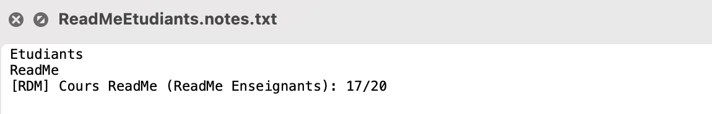
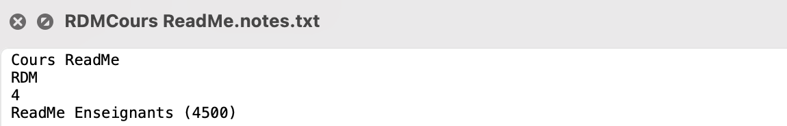

# Projet MAUI : comme je veux
Ce projet a été réalisé par Couturier Timothé `20091` et Ben Yamoune Ayoub `21160` dans le cadre des laboratoires concepts informatiques.

## Introduction
Ce projet MAUI vise à concevoir une application complète pour la gestion des étudiants, des enseignants, des activités, des notes, et des bulletins au sein d'une école.


## Utilisation de l'application
Suivez les étapes ci-dessous pour une utilisation optimale de l'application.


### Création d'un étudiant
Ajoutez un étudiant en accédant à la page "Étudiants" et en entrant le nom et le prénom correspondant.

L'exemple ci-dessus montre l'ajout réussi de l'étudiant "Étudiants ReadMe".


### Création d'un enseignant
Pour ajouter un enseignant, rendez-vous sur la page "Enseignants" et entrez le nom, le prénom et le salaire correspondant.

L'exemple ci-dessus montre l'ajout réussi de l'enseignant "Enseignants ReadMe".

### Création d'une activité
Ajoutez une activité en accédant à la page "Activites" et en entrant le nom de l'activité, le trigramme, le nombre de crédits et en sélectionnant l'enseignant correspondant.

L'exemple ci-dessus montre la création réussie de l'activité "Cours ReadMe" avec 4 crédits.

### Création d'une évaluation 
Ajoutez une cote ou une appréciation en sélectionnant l'étudiant, le trigramme du cours et en spécifiant la cote ou l'appréciation.

### Création d'un bulletin 
Sélectionnez un étudiant pour afficher son bulletin.


### Sauvegarde 
Toutes les données sont sauvegardées dans des fichiers texte. Voici quelques exemples.




## fonction supplémentaire 
Notre fonctionnalité supplémentaire propose un affichage budgétaire de l'école, offrant ainsi une vue sur les coûts mensuels et annuels des salaires des enseignants.


## Diagrammes 
### Diagramme de Séquence - Ajout d'un enseignant
Voici un diagramme représentant les différentes méthodes utilisées lors de l'ajout d'un enseignant.

### Diagramme de Classes
Ce diagramme présente toutes les classes utilisées dans le code.


## Principes SOLID
Nous nous sommes efforcés de respecter les principes SOLID durant la conception de notre code.


### S - Single Responsabillity Principle
Le premier principe qui est le principe de responsabilité unique veut que chaque classe n'ait qu'une seule responsabilité. Nous avons alors assigné une seule responsabilité à chaque classe. Par exemple, la classe `EtudiantsPage` gère uniquement les étudiants.
```csharp 
namespace School.Views;
using System.Collections.ObjectModel;
using System.Runtime.CompilerServices;
using School.Models;

public partial class EtudiantsPage : ContentPage
{
	public ObservableCollection<Etudiants> etudiantsList {get; set;} = new ObservableCollection<Etudiants>();
	public EtudiantsPage()
	{
		InitializeComponent();

		BindingContext = this;

		LoadEtudiantsList();
	}

	public void LoadEtudiantsList()
	{
		etudiantsList.Clear();

		foreach (var ens in Etudiants.LoadAll())
		{
			etudiantsList.Add(ens);
		}
	}

	private void OnAddStudentClicked(object sender, EventArgs e){
		string firstname = FirstnameEntry.Text;
		string lastname = LastnameEntry.Text; 

		Etudiants newetudiant = new Etudiants(firstname,lastname);
		newetudiant.Save();
		etudiantsList.Add(newetudiant);

		DisplayAlert("Succes","Student was successfully added !","ok");

		FirstnameEntry.Text = string.Empty;
		LastnameEntry.Text = string.Empty;
	}
```
### D - Depedency Inversion Principle
Nous avons également tenté de respecter le principe de l'inversion de dépendance qui veut que chaque classe ne puisse dépendre que de classe abstraite. Par exemple, les classes `Appreciations` et `Cotes` dépendent toutes deux uniquement de la classe abstraite `Evaluation`. Voici la classe abstraite dont il est question ; 

```csharp 
namespace School.Models;

public abstract class Evaluations
{
    private Activity activity;

    public Evaluations(Activity activity) {
        this.activity = activity;
    }

    public Activity Activity {
        get {
            return activity;
        }
    }

    public abstract int Note();

    public override string ToString()
    {
        Console.WriteLine("In Tostring/evaluation");
        Console.WriteLine("Activity: {0}", Activity);
        Console.WriteLine("Note(): {0}", Note());
        return String.Format("{0}: {1}/20", Activity, Note());
    }
}
```